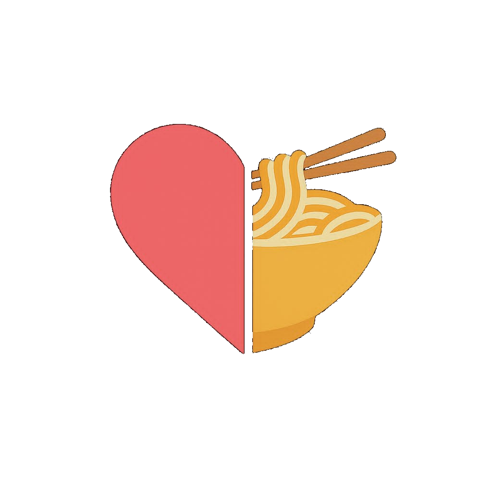

# 🍜 foo'die

> Một app nhỏ tôi tự làm cho người yêu — để hai đứa cùng ghi lại những bữa ăn mỗi ngày, dù có ở gần hay ở xa nhau.

---

## 💡 Câu chuyện

Tôi làm app này vì muốn biết hôm nay người yêu ăn gì, ăn có ngon không, có ăn sáng đúng giờ không. Không cần nhắn tin hỏi mỗi ngày — chỉ cần mở app lên là thấy nhau đang ăn gì. Nhỏ thôi nhưng đủ để cảm thấy gần hơn một chút.

---

## ✨ Tính năng

### 📸 Check-in bữa ăn
- Chụp ảnh món ăn trực tiếp trong app (camera trước/sau)
- Hoặc chọn ảnh từ thư viện
- Ghi tên món, chọn bữa (Sáng / Trưa / Tối / Snack), thêm ghi chú cảm nhận

### 🏠 Feed chung
- Xem tất cả bữa ăn của cả hai theo thời gian thực
- Thả ❤️ cho bữa ăn của nhau
- Chỉnh sửa hoặc xóa bài của chính mình

### 🔥 Streak ăn sáng đôi
- Tự động tính chuỗi ngày liên tiếp mà **cả hai** đều ăn sáng trước 10 giờ sáng
- Hiển thị 7 ngày gần nhất dạng vòng tròn
- Nếu chọn bữa Sáng mà đã qua 10h, app sẽ nhắc nhở không tính streak

### 🏆 Cột mốc bí mật
Khi đạt đủ số ngày streak, app sẽ mở khóa những bí mật và phần thưởng bất ngờ:

| Mốc | Tên | Phần thưởng |
|-----|-----|-------------|
| 3 ngày | 🎁 Mầm xanh | Món quà bí mật |
| 7 ngày | 🔥 Một tuần bùng cháy | Thử thách nấu ăn |
| 14 ngày | 💫 Hai tuần lung linh | Tờ giấy nhắn bí mật |
| 30 ngày | 🌙 Một tháng trăng | Hẹn hò bữa sáng |
| 100 ngày | 💎 100 ngày kim cương | Chuyến đi chơi |
| 365 ngày | 👑 Một năm hoàng kim | Bữa sáng nhà hàng tại nhà |

### 📊 Thống kê
- Tổng số bữa ăn trong tuần
- Số bữa được thả tim
- Món ăn hay ăn nhất
- Phân bố theo bữa (biểu đồ thanh)
- Lọc theo từng người hoặc cả hai

### ⚙️ Cài đặt (Drawer)
- Đổi tên hiển thị
- 6 màu giao diện: Tối ấm, Sáng, Hoa hồng, Rừng xanh, Đại dương, Pastel
- 6 hình nền: Hoa anh đào, Hoàng hôn, Đêm khuya, Matcha, Kẹo ngọt

---

## 🛠️ Công nghệ

| Thứ | Dùng gì |
|-----|---------|
| Frontend | HTML + CSS + Vanilla JS (PWA) |
| Database | Firebase Firestore (realtime sync) |
| Lưu ảnh | ImgBB API |
| Deploy | Vercel |
| Font | Pacifico, Nunito, DM Sans |

---

## 📱 Cài lên điện thoại

App này là **PWA** — không cần App Store hay Google Play.

**iOS (Safari):**
1. Mở link bằng Safari
2. Bấm nút Share → **Add to Home Screen**
3. Bấm Add → Icon xuất hiện trên màn hình!

**Android (Chrome):**
1. Mở link bằng Chrome
2. Bấm menu ⋮ → **Add to Home Screen**

---

## 🚀 Tự chạy

1. Clone repo
2. Mở `index.html` bằng Live Server (VS Code) hoặc deploy lên Vercel/Netlify
3. Tạo Firebase project, bật Firestore
4. Thay `firebaseConfig` trong `index.html`
5. Tạo tài khoản ImgBB, thay API key

---

*Made with ❤️ — vì yêu thì phải biết người ta hôm nay ăn gì.*
